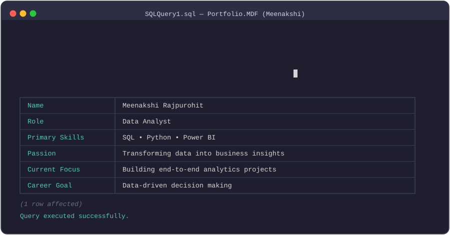

<p align="center">

</p>


<h1 align="center">Hi 👋, I'm Meenakshi Rajpurohit</h1>
<h3 align="center">A passionate Data Analyst from India</h3>


<p align="center">
  
</p>


<p align="center">
  
</p>


- 🔭 Currently working on **real-world data analytics projects**
- 💡 Skilled in **SQL, Power BI, and Python for Data Analysis**
- 👩‍💻 Explore all my projects on [GitHub](https://github.com/meenakshi-12345)
- 📝 Passionate about analyzing real-world datasets and generating actionable insights
- 💬 Ask me about **SQL, Data Cleaning, EDA, and Dashboard Building**
- 📫 Reach me at **imeenakshii28@gmail.com**
- ⚡ Fun fact: I love web series - Stranger Things 


## 🌐 Socials:

<a href="mailto:imeenakshii28@gmail.com">
  
</a>

<!-- LinkedIn -->
<a href="https://www.linkedin.com/in/meenakshirajp28">
  
</a>

<!-- HackerRank -->

<a href="https://www.hackerrank.com/imeenakshii28">
  
</a>

<!-- Kaggle -->
<a href="https://www.kaggle.com/meenakshirajp28">
  
</a>

<!-- Discord -->
<a href="https://discord.com/users/1437277015672750231">
  
</a>


## 💻 Tech Stack:
 
                


## 🧩 Problem-Solving Platforms  

<p align="center">
  <a href="https://www.hackerrank.com/imeenakshii28">
    
  </a>
  &nbsp;&nbsp;&nbsp;
  <a href="https://leetcode.com/u/Meenakshi_Rajpurohit28/">
    
  </a>
</p>

<p align="center">
  <a href="https://www.codechef.com/users/meenakshi_rajp">
    
  </a>
</p>


<p align="center">
  💡 Consistently practicing and building 
</p>

## 📊 My Working KPI's

<table align="center">
<tr>

<td align="center" width="180" height="150">


<br>


<br>

<b>Projects</b>

</td>

<td align="center" width="180" height="150">


<br>


<br>

<b>Dashboards</b>

</td>

<td align="center" width="180" height="150">


<br>


<br>

<b>SQL Problems</b>

</td>

<td align="center" width="180" height="150">


<br>


<br>

<b>Tools</b>

</td>


</tr>
</table>


<h2 align="left">🎓 Education</h2>

<div align="center">


</div>

<br>

```yaml
🎓 Degree      : B.Tech in Computer Science & Engineering
🏫 College     : Government Engineering College, Bikaner
📅 Duration    : 2022 — Present

💡 Specializing In
   ├── Data Analytics
   ├── SQL & Python
   ├── Problem Solving
   └── Data-Driven Solutions

📚 Relevant Coursework
   ├── Database Management Systems
   ├── Object-Oriented Programming
   ├── Operating Systems
   ├── Artificial Intelligence & Machine Learning
   ├── Data Analytics & Statistics
   └── Problem Solving Skills

🏆 Highlights
   ├── Strong academic consistency
   ├── Upward performance trend
   ├── Real-world dataset exposure
   └── Analytical & logical thinking

⚡ Leadership
   └── Core Member — Industry Institute Interaction Cell (IIC)


```
## 🧠 The Human Behind the Data  

```python
class Meenakshi:

    def __init__(self):
        self.human_side = {
            "Reading": "85% - Expanding knowledge beyond syllabus",
            "Painting": "90% - Visual creativity & patience",
            "Journaling": "75% - Structured thinking & reflection"
        }

        self.how_it_helps_my_career = {
            "Reading": "Improves analytical depth",
            "Painting": "Enhances visualization creativity",
            "Journaling": "Strengthens clarity in communication"
        }

        self.core_belief = "Data is logical. Creativity makes it powerful."

    def summary(self):
        return "Creative + Analytical Hybrid 🚀"
```


<p align="center">
     
   </p>


## 🏆 Certifications


<p align="center">
  <a href="https://www.hackerrank.com/certificates/7b9b7b916255">
    
  </a>
  &nbsp;&nbsp;&nbsp;
  <a href="https://www.theforage.com/completion-certificates/ifobHAoMjQs9s6bKS/gMTdCXwDdLYoXZ3wG_ifobHAoMjQs9s6bKS_HH6KYc4gmAiBsPNAs_1769526392899_completion_certificate.pdf">
    
  </a>
  &nbsp;&nbsp;&nbsp;
  <a href="https://forage-uploads-prod.s3.amazonaws.com/completion-certificates/9PBTqmSxAf6zZTseP/io9DzWKe3PTsiS6GG_9PBTqmSxAf6zZTseP_HH6KYc4gmAiBsPNAs_1752233970152_completion_certificate.pdf">
    
  </a>
</p>


## ⚡ Data Workflow


</div>

---


<table>
<tr>
<td align="center">📂<br><b>Messy Data</b></td>
<td>➡️</td>
<td align="center">🧹<br><b>SQL Cleaning</b></td>
<td>➡️</td>
<td align="center">🐍<br><b>Python Analysis</b></td>
<td>➡️</td>
<td align="center">🔍<br><b>Insights</b></td>
<td>➡️</td>
<td align="center">📊<br><b>Dashboard</b></td>
<td>➡️</td>
<td align="center">🚀<br><b>Business Decisions</b></td>
</tr>
</table>

</div>

</div>

---


<h2 align="center"> Connect With Me ✨</h2>

<p align="center">
  <a href="mailto:imeenakshii28@gmail.com">
    
  </a>
  
  <a href="https://www.linkedin.com/in/meenakshirajp28">
    
  </a>
</p>

<p align="center">
  
</p>


<p align="center">

</p>


